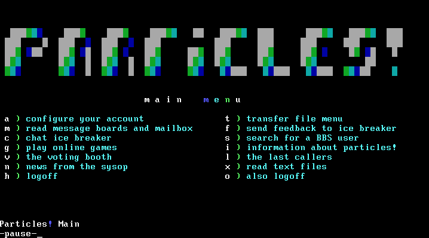
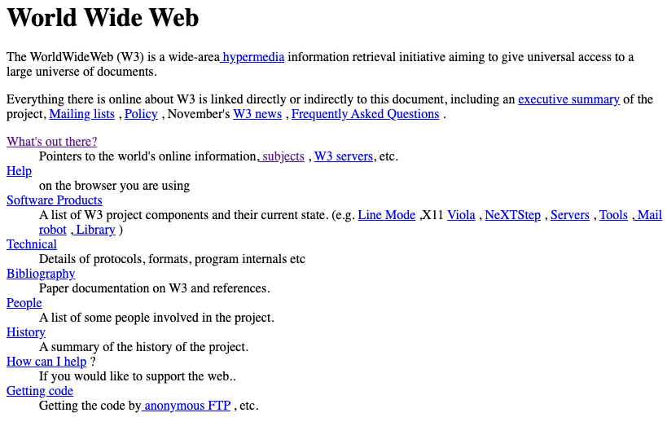

## History of the Web
* What is the difference between the internet and the web?
* Why was/is HTML empowering?

===
## History of the Web

### The Internet

* The global computer network. NOT web pages!
* Websites are just one thing that we use the internet for (its by far the most popular thing)

### Bulletin Board Systems (BBS)

_Screenshot of Partices BBS at [particles.org](https://particles.org)_

* Pre-web service. Connected to from old computer terminals, some still exist today!
* Usually centered around a single topic
  * kind of like a Facebook Group/Page, Subreddit, or Forum

<iframe width="560" height="315" src="https://www.youtube.com/embed/RuZUPpmXfT0?start=410" frameborder="0" allow="accelerometer; autoplay; encrypted-media; gyroscope; picture-in-picture" allowfullscreen></iframe>

### WWW (World Wide Web)

* Timeline
  * Tim Berners-Lee invented WWW in 1989
  * First web browser in 1990
  * The browser was released outside CERN in 1991 
  * 1993 - WWW announced free to use, Mosaic web browser came out (first popular browser), web browser are available on Macs, PCs, and most other popular computers of the time
  * Basically the web went from an idea to a part of mainstream culture in 6 years, from 1989 - 1995
* Some classic pages that still exist:
  * [The first webpage!](http://info.cern.ch/hypertext/WWW/TheProject.html)
  * [SpaceJam](https://www.spacejam.com/archive/spacejam/movie/jam.htm)
  * Find more: [WayBack Machine](https://archive.org/web/)

### Why was the web such a big deal?

* You only need two things to view web pages:
  * a web browser
  * an internet connetion
* Websites are easy to access, and don't require you to be a member of a specific community, like a BBS
* websites published on the internet are truly global, not just available to small group, like the members of a BBS
* HTML is easy to read / write
  * Anyone can learn it by looking at other websites
  * Hyper Text Markup Language
    * Hypertext = Links!
    * Markup = kind of like code, but more like a document

### **Activity:** Let's look at some HTML (I promise its not that scary)

* Visit [the first web page](http://info.cern.ch/hypertext/WWW/TheProject.html)
* Right click on the page and select **View Page Source** (in Chrome)
* Open Notepad (Windows), Textedit(Mac), or the text editor of your choice
* copy and paste the source code from the first web page, into your text editor.
* Open mypage.html
  
#### Going further

After editing the file, make sure to save and reload the page in your browser!

1. Change "Frequently Asked Questions" to "FAQs"
2. Edit the header at the top of the page to say your name
3. Delete the people section from the web page

Bonus round:

1. Change the name of the tab
2. Add an image to the bottom of the page
    * ``
    * You could use this image on my website at this url: `https://i.imgur.com/gWfHJNJ.jpg`