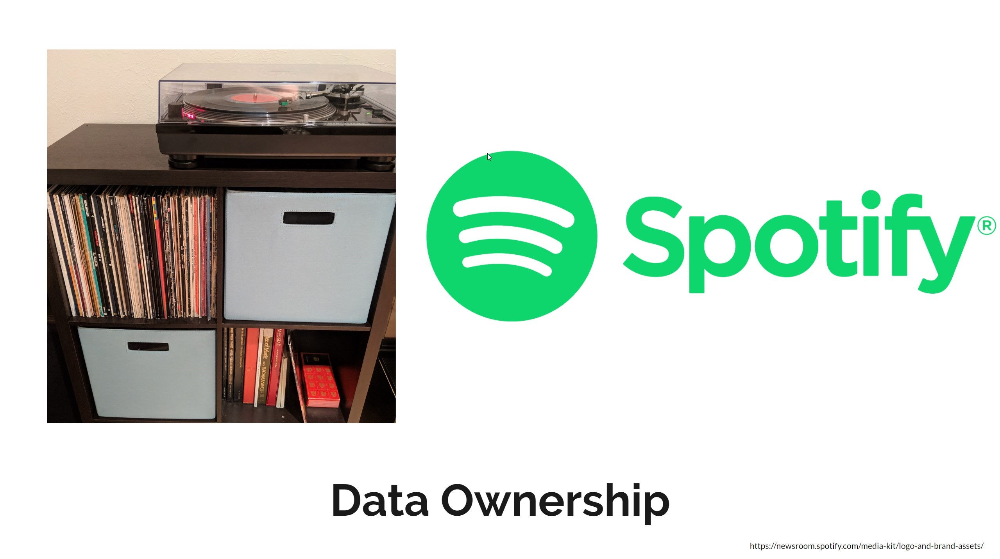
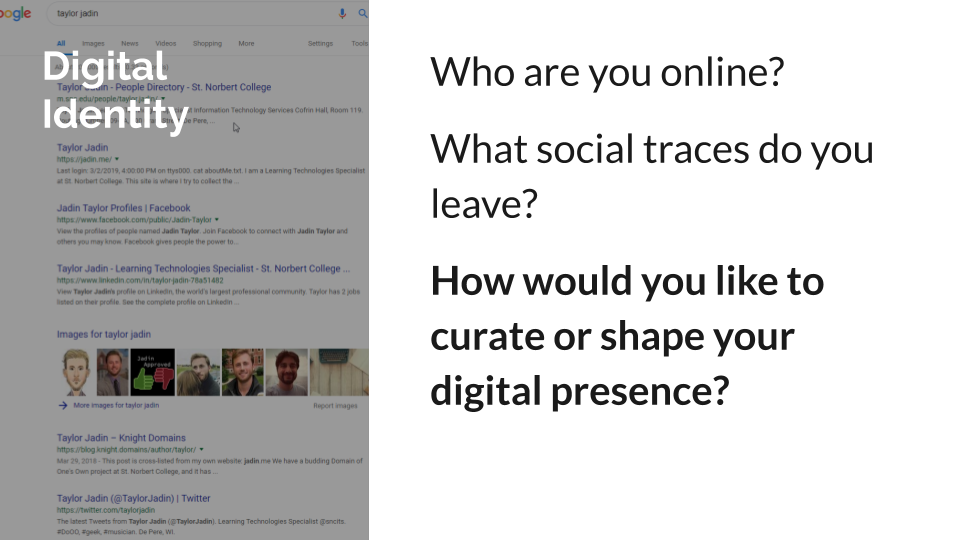

# Data Ownership

* What does it mean to own something?
* How does the business model of a "free" service affect its customers?

---
# What does it mean to own something?
 * What are things in your life that you own?
 * In what way do you own them?
  
---
# What does it mean to own something?
 * If someone has the ability to take something from you, do you still own it?
 * If a website that you used shuts down, and you can no longer access your data, do you still own it?

---
[.background-color: #FFFFFF]

---
[.background-color: #FFFFFF]

---
[youtube]https://www.youtube.com/watch?v=y1txYjoSQQc[/youtube]

